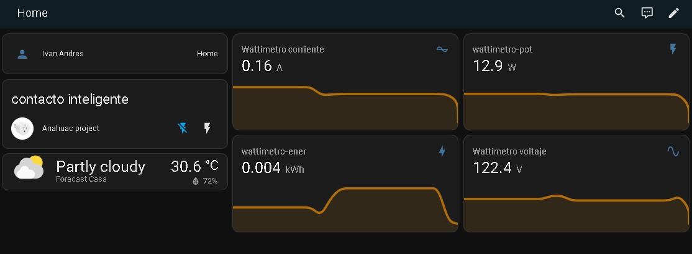
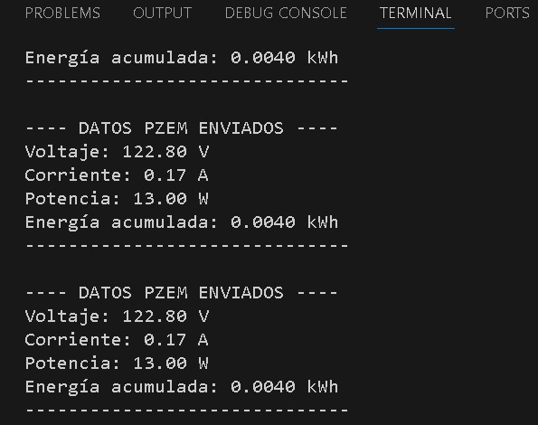

---
# mqtt-energy-monitor
ESP32 and PZEM-004T Energy Monitor for Home Assistant

This repository contains the source code (firmware) to build a DIY electricity consumption monitor. It uses an ESP32 microcontroller to read measurements from a PZEM-004T v3.0 sensor and sends them to an MQTT broker, allowing seamless integration with Home Assistant and its energy dashboard.

---

## ⚙️ Key Features  (Características Principales)

* **Real-time reading** of Voltage (V), Current (A), Active Power (W), and Accumulated Energy (kWh).
* Wireless communication via **Wi-Fi**.
* **MQTT protocol** for light and efficient communication with home automation systems.
* Easy integration with the Home Assistant **Energy dashboard**.
* **Low cost** and **100% local control**, without reliance on cloud services.

---

## 🔧 Required Components (Componentes Necesarios)

### Hardware

* **ESP32** microcontroller.
* **PZEM-004T v3.0** non-invasive energy sensor with its current transformer coil.
* Power supply for the ESP32 (e.g., 5V USB).
* Cables for connections.

### Software and Libraries

* **Arduino IDE** or **PlatformIO**.
* **`PZEM004Tv30`** Library
* **`PubSubClient`** Library

---

## 🛠️ Configuration (Configuración)

Before compiling and uploading the firmware, you must modify the code to include your own credentials in the following lines:

```cpp
// Your WiFi network configuration
const char* ssid = "YOUR_WIFI_SSID";
const char* password = "YOUR_WIFI_PASSWORD";

// Your MQTT Broker configuration
const char* mqtt_server = "YOUR_BROKER_IP"; // E.g.: "192.168.1.100"
const int mqtt_port = 1883;
const char* mqtt_user = "YOUR_MQTT_USERNAME";
const char* mqtt_pass = "YOUR_MQTT_PASSWORD";
```
---

## 📸 Implementation & Data Gallery (Galería de Implementación y Datos)

### Monitoring Current
A detailed view of how current is recorded over time in Home Assistant:


### Home Assistant Dashboard
This shows how the PZEM-004T information is integrated and visualized in the main Home Assistant dashboard:


### Terminal Data
Screenshot of the data output in the terminal, showing real-time measurements:


### Physical Implementation
View of the provisional connection and assembly of the components:

