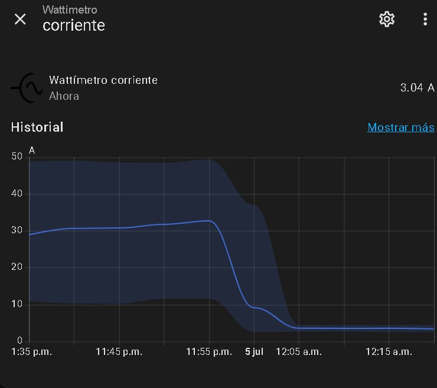

# mqtt-energy-monitor
Monitor de Energía con ESP32 y PZEM-004T para Home Assistant
Este repositorio contiene el código fuente (firmware) para construir un monitor de consumo eléctrico DIY. Utiliza un microcontrolador ESP32 para leer mediciones de un sensor PZEM-004T v3.0 y las envía a un broker MQTT, permitiendo una integración perfecta con Home Assistant y su panel de energía.

⚙️ Características Principales
Lectura en tiempo real de Voltaje (V), Corriente (A), Potencia Activa (W) y Energía Acumulada (kWh).

Comunicación inalámbrica a través de Wi-Fi.

Protocolo MQTT para una comunicación ligera y eficiente con la domótica.

Fácil integración con el dashboard de Energía de Home Assistant.

Bajo costo y control 100% local, sin depender de servicios en la nube.

🔧 Componentes Necesarios
Hardware
Microcontrolador ESP32.

Sensor de energía no invasivo PZEM-004T v3.0 con su respectiva bobina de corriente.

Fuente de alimentación para el ESP32 (e.g., 5V USB).

Cables para las conexiones.

Software y Librerías
Arduino IDE o PlatformIO.

Librería PZEM004Tv30

Librería PubSubClient

## 📸 Galería de Implementación y Datos

### Monitoreando Corriente
Una vista detallada de cómo se registra la corriente a lo largo del tiempo en Home Assistant:

### Dashboard de Home Assistant
Así se integra y visualiza la información del PZEM-004T en el dashboard principal de Home Assistant:

### Datos en Terminal
Captura de pantalla de la salida de datos en el terminal, mostrando las mediciones en tiempo real:

### Implementación Física
Vista de la conexión y el montaje provisional de los componentes:

